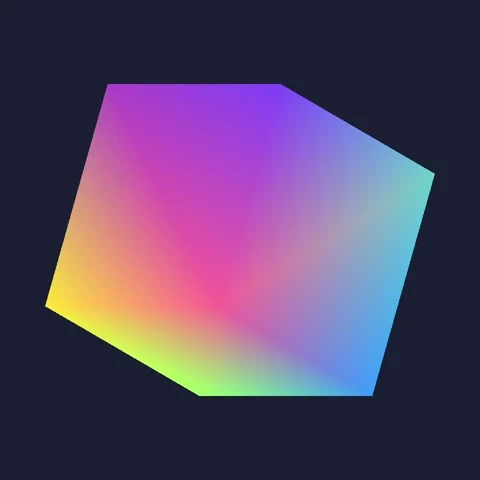

A basic OpenGL thin wrapper. mostly for personal purposes but it has some examples.

Here's the example `imgview` which takes the path of an image on the command line,
then opens it in an SDL+OpenGL window.

Here is an analog clock. See `attributions.txt` in its directory for the attribution for the background
clock face. Hand textures are genreated by a script.

GPU takes in the clock texture and hand textures and the current time, then generates a clock. Note
that the minutes and hours hands travel between integer quantities, e.g. the hours hand will be halfway
to 10 at 9:30.

There is also `rotatingcube`. I took the example [here from GitHub user c2d7fa](https://github.com/c2d7fa/opengl-cube/) and am currently porting it to
use Krill's replacements for OpenGL calls. Additionally, I modified rotation logic to happen in the _shader_ and added FPS limiting, hardcoded
to my monitor refresh rate of 165Hz.

